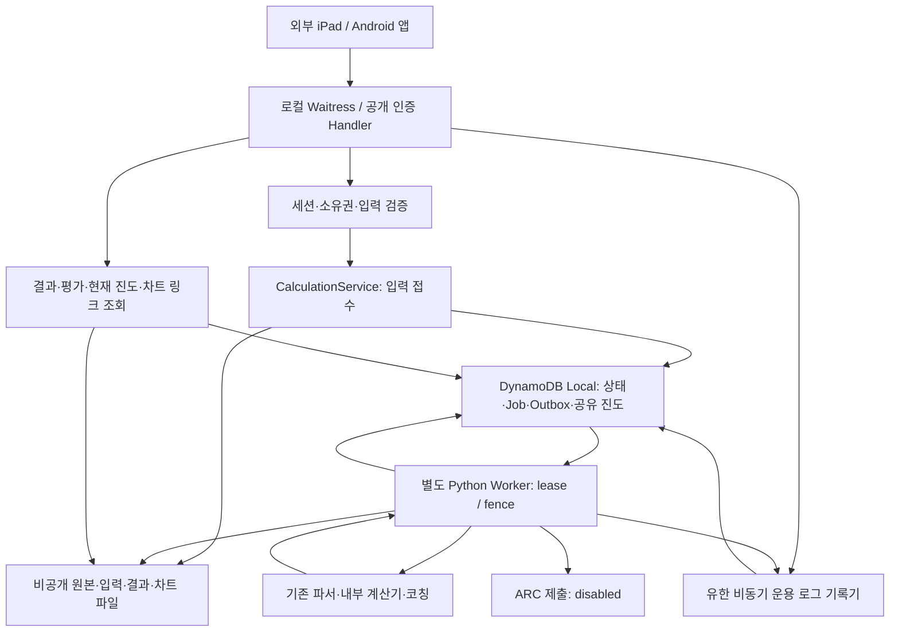

# 현재 구조와 보안 경계

2026-09-11 소스 재점검 기준. 사용자 정책은 [결정 문서](DECISIONS.md), HTTP·계산 필드는 [상세 계약](ARC_MOCK_IMPLEMENTED_API_CONTRACT_KO.md), 명령은 [로컬 실행](LOCAL_RUN.md)과 [AWS 후속 안내](DEPLOY_GUIDE.md)를 따른다. 이 문서는 현재 구조를 설명하며 미구현 ARC/AWS 연결을 완료로 취급하지 않는다.

## 기술과 실행 경계

이 저장소는 Python 백엔드다. iPad/Android 화면과 마네킨 연결 코드는 포함하지 않으며, 앱이 모은 실제 측정 binary를 받는다. 웹 프런트엔드 빌드나 Node 패키지 구성은 없다.

| 폴더·진입점 | 역할·의존 방향 |
|---|---|
| `scripts/serve_local.py` → `local_server/cli.py` | Python 3.12 + Waitress 3.0.2 HTTP 서버, Java/Javac + DynamoDB Local 3.3.1 실행 감독 |
| `lambda_handler.run` → `mock_journey/handler.py` | AWS REST proxy 요청의 공개 인증 진입점. HTTP API v2 이벤트는 계약 밖 |
| `mock_journey/` | 인증·훈련 상태·계산 접수·저장·Worker·Relay. `assembly.py`가 외부 client를 주입 |
| `mock_journey/execution_definitions.py` | 승인된 15개 실행 정의. 로컬 감독기에서 분리해 ZIP에서도 재사용 가능. 자원·키·운영 한도는 포함하지 않음 |
| `main.py`, `services/`, `data_handlers/` | 파싱된 입력 → 준비·계산·직렬화·기존 코칭, 오류 정제와 로그 |
| `calculators/`, `transformers/`, `models/`, `config/` | 계산 수식, 측정 구간 분리, 데이터 모델, guideline·점수 기준 |
| `resources/prompt_books/`, `util/` | 기존 코칭 문구와 업로드 규격. 런타임 문맥으로 로컬/Worker의 저장 부작용을 분리 |
| `tests/` 및 별도 통합 시험 폴더 | 회귀·참고 출력·보안·실제 loopback HTTP/DB 검사. 기본 pytest는 `tests scripts`만 수집 |
| `scripts/build_mock_artifact.py`, `deployment_preflight.py` | 네트워크 없는 ZIP 생성·설정 검사. 배포 shell은 사용자가 나중에 직접 실행 |

핵심 SDK는 boto3 1.34.140, Sentry SDK 2.22.0이다. 직접 의존성은 `requirements.txt`, 이미 검증한 배포 간접 의존성 버전은 `constraints-lambda.txt`, 로컬 서버 의존성은 `requirements-local.txt`에 둔다. 새 프레임워크·컨테이너·DB 스키마는 도입하지 않았다.



실선은 현재 로컬 동작이다. AWS에서는 DynamoDB/S3/SQS client를 같은 공용 구성에 연결할 수 있으나, 기본 AWS runtime의 계산 접수·Worker·Relay·운용 로그 연결은 아직 없다. 다이어그램의 전체 경로가 AWS에 배포됐다는 뜻이 아니다.

## 요청부터 결과까지

```text
앱 로그인 → 프로그램/연령 선택 → attempt 생성
 → Bearer + X-Attempt-ID + /cpr-analysis (또는 attempt 계산 경로)
 → 인증·소유권 → 기존 multipart/base64 파서·검증 → 허용 입력 projection
 → 원본/입력 문서 저장 확인 → DB에 입력 참조·Job·Outbox 접수
 → 처리 중202 또는 이미 완료된200

별도 실행기 → 동일 내부 계산기 → 점수·통계·코칭·차트
 → 후보 결과 저장/확인 → 별도 목표+Pass 평가 → 최종 DB 거래

GET calculation → 저장 계산 결과 + submit_arc: disabled
GET attempt → 평가·현재 진도 반영 사유
GET programs → 현재 공유 진도
GET chart-link → 새300초 차트 URL → 실제 차트 JSON GET
```

HTTP 요청 수명, 계산 작업 수명, 앱의30초 대기를 분리한다. 새 접수는 영속 보관을 확인한 뒤202로 알리며 GET이 계산을 다시 수행하지 않는다. 계산 성공·완료 평가·현재 epoch 진도 적용·외부 제출은 같은 값이 아니다.

## 공용 코드와 역할

| 구성 | 책임 |
|---|---|
| `lambda_handler.run` → `mock_journey.handler.run` | 공개 인증 입구. 비공개 `_run_trusted_calculation`은 회귀 helper |
| `mock_journey/service.py`, `auth.py`, `catalog.py` | 세션·재인가·프로그램·시도 제어 |
| `mock_journey/calculation.py`, `projection.py`, `typed.py` | 소비되는 입력과 자료형·고정 정의 확인, 입력 식별/접수/조회 |
| `mock_journey/state.py`, `jobs.py` | DB 거래, 입력 중복, 세션/시도 귀속, 공유 epoch, 작업 소유권·최종 확정 |
| `mock_journey/storage.py` | 기존 raw/chart 규격 연결, 참조의 namespace·binding·크기/hash·읽기 검증 |
| `mock_journey/internal_calculator.py` | 내부 계산 호출·검증된 관측량/후보 생성. 계산 코어 복제 없음 |
| `mock_journey/worker.py` | Job 수행/후보 복구·차트 게시·평가·최종 저장 |
| `mock_journey/dispatch.py` | Outbox 전달과 독립 due 재조정. Queue에는 job_id만 전달 |
| `mock_journey/assembly.py`, `settings.py` | client·키·저장 binding·정의·버전·한도를 명시적으로 조립 |
| `submit_arc.py` | 별도 제출 경계. 현재는 계약 대기 disabled, 네트워크 요청 없음 |

API는 세션/입력·결과 저장 권한, Worker는 작업/파일·계산 권한, Relay는 due/Outbox·큐 전달 권한을 필요로 한다. Worker/Relay에 앱 Bearer/resume keyring을 넘기지 않는다. 논리 역할의 구분이며 실제 AWS 함수 배치는 아직 연결 설계 대상이다.

## 입력·계산 호환성

- 기존 parser와 Calculator를 사용한다. 인증 뒤 attempt 고정 condition/calculation_profile, 허용 response context, VP와 원본 bytes를 보관한다.
- 정수·실수·bool·null·누락·빈 객체를 구별하는 typed 직렬화/해시를 유지한다. 입력 필드 순서 같은 비소비 차이와 실제 값 차이를 구별한다.
- HSTM credential, Authorization 및 원래 event 전체를 저장 입력에 넣지 않는다. 문서 필드가 parser에 있다는 사실이 모든 leaf의 projection 허용을 뜻하지 않는다.
- 현재 로컬 projection의 `metric_fields={}`는 ResultByCriteria 세부 수치 입력 전체를 지원한다는 선언이 아니다. 새 leaf는 실제 소비 코드 근거·명시 schema·회귀로 추가한다.
- HSTM 호환 문서는 메모리에서 기존 생성 경로를 따르며 새 앱 응답 필드나 ARC 제출 자료로 자동 노출하지 않는다.
- 임의 URL 중계·HSTM token refresh·외부 Scoring 호출을 되살리지 않는다.

## 점수와 완료의 버전 경계

기존 v1 후보는 `arc-internal-calculation-v1`이며 상태 필드 없는 기존 평가를 보존한다. v1 CPR resolver가 없으면 여전히 구성 오류다.

현재 로컬은 `arc-local-calculator-pending-v2` adapter, `tester-goal-pending-v2` profile, `arc-local-projection-v1`을 명시하고 `allow_pending_cycle_goal=True`로 조립한다. 후보는 `arc-internal-calculation-v2`다. 예약 버전에 반대 flag를 넣거나 pending flag와 cycle resolver를 함께 넣는 조합은 거절한다. 저장된 v1 작업을 v2로 몰래 바꾸지 않는다.

| 구분 | 실제 점수 | 목표 평가 | 완료 |
|---|---|---|---|
| Only | 기존 tester Pass/Fail | 관측 정수 횟수와 required 비교, status=evaluated | 목표와 Pass 모두 충족할 때 true |
| CPR 계열 | 같은 내부 계산·기존 tester Pass/Fail | status=pending_policy, observed/met=null | false; GOAL_POLICY_UNRESOLVED |

pending 결과도 정상 저장되면 계산 HTTP200이며 active count는 한 번 해제한다. 점수가 Fail이면 SCORE_NOT_PASS도 별도로 기록한다. 미정 목표를0으로 만들어 GOAL_NOT_MET/Fail로 치환하지 않는다.

## DB·재시도·공유 진도

- 같은 세션의 `client_request_id`+동일 생성 입력은 기존 attempt를 돌려준다. 응답의 attempt/resume을 받은 후 측정을 시작한다. 세션 간 생성 요청 복구는 별도 미정이다.
- 같은 attempt+동일 소비 입력은 같은 Job/확정 결과를 사용한다. 다른 입력은409이며 기존 결과를 덮지 않는다.
- PK/SK 상태 행과 GSI1(`GSI1PK:S`, `GSI1SK:N`, Projection ALL)로 due 작업을 조회한다. 조회한 행의 실제 due/lease를 다시 확인한다.
- 작업 owner·lease·fence와 call/candidate를 검증한다. 파일 저장과 DB 거래를 하나의 transaction으로 주장하지 않는다. 후보·최종 참조를 검증한 뒤 기존 최종 거래로 평가/상태/진도를 한 번 반영한다.
- Outbox 전송 후 확인 전 장애는 중복 wake를 만들 수 있다. Stream·Queue의 정확히 한 번 전송을 가정하지 않는다. sent Outbox/DLQ가 있어도 미완료 due Job의 재조정이 필요하다.
- 한 세션 logout이 전체 사용자 progress_epoch를 바꾼다. 이전 epoch 결과는 저장하되 PROGRESS_RESET으로 새 완료·active count·revision에 반영하지 않는다.
- 프로그램 목록이 현재 공유 진도의 기준이다. 이미 완료된 슬롯의 동시 후발 실패/대기 결과로 완료를 지우지 않는다.
- 만료/폐기된 bound session만 새 세션으로 재인가 가능하다. 현재 활성인 다른 세션의 시도를 빼앗지 않는다. cancelled는 재인가 불가다.

## 기본 로컬 실행 구성

`scripts/serve_local.py`는 기본 Journey 모드다. Waitress HTTP, 소유한 Java DynamoDB Local, 별도 Python spawn Worker, private 파일 저장/차트를 연결한다. `--control-only`는 과거 제어 API 구성이다.

- 설치 잠금·0700 디렉터리·0600 키·UID·sentinel·배포 파일 hash를 확인한다. DB는127.0.0.1 전용이며 자식 nonce handshake로 자신이 실행한 DB인지 확인한다.
- 정확한 기존 PK/SK-only 설치에만 GSI1을 추가한다. 키·세션·진도 행을 초기화하지 않는다. GSI ACTIVE 전 ready를 선언하지 않고, 낯선 인덱스/설치나 혼합 키는 거절한다.
- 부모만 설치 초기화/이행을 수행한다. Worker의 `initialize=False`는 기존 설치/테이블 읽기 확인이며 키·테이블을 생성하지 않는다.
- spawn 자식은 client를 별도 생성한다. fork로 client/socket/lock을 복제하지 않고 비밀값을 argv/환경/로그로 전달하지 않는다.
- CLI는 AWS/BOTO/ARC/Sentry/프록시 환경을 격리하고 Python outbound를 소유 loopback DB로 제한한다. 외부 자격 증명 탐색·AWS·ARC 호출을 하지 않는다.
- Worker의 주기 lease 갱신은 실패를 보존하고 마지막 DB fence 이전까지 확인한다. 갱신 callback/정리의 시간 경계를 유지하며 로컬60초 lease를 앱30초 취소 시간으로 사용하지 않는다.

DB·Worker·HTTP 준비/생존을 감독한다. 필수 실행기가 사라지면 계속202를 접수하지 않고 실패 종료하여 같은 설치 재시작으로 복구한다. `/healthz`는 비밀 경로 없이 mode·가용성·미정 완료 정책을 표시한다.

정상 종료는 접수 중단→HTTP drain→Worker 중단/제한된 회수→저장/DB 정리 순서다. 이미 죽은 자식의 공유 Condition 응답을 기다리는 방식을 쓰지 않고 one-way pipe로 중단 신호를 준다. 정리되지 않은 요청이 잠금을 보유할 경우 부모가 공유 객체 정리에서 무제한 기다리지 않도록 실패 종료한다. 자신이 소유한 프로세스만 회수한다. 부모 SIGKILL 후 기존 Java DB orphan 가능성은 남아 있으며 알 수 없는 PID를 자동 종료하지 않는다.

## 비공개 파일·차트

파일 저장소는 namespace/key의 hash를 파일명으로 사용한다. 버전 magic+제한된 JSON header+원본 bytes의 단일 envelope에 설치·bucket·key·size·SHA-256·허용 metadata를 검증한다.

- 열어 둔 private directory fd와 `O_NOFOLLOW`/`fstat`로 상대 파일을 검증한다. symlink·hardlink 복수·device/FIFO·경로 이탈·다른 UID/권한을 허용하지 않는다.
- 프로세스 간 flock과 인스턴스 RLock 안에서 쓰기·quota를 제어한다. 동일 key/내용/metadata는 재사용하고 다른 내용으로 덮지 않는다.
- 임시 파일 fsync→atomic replace→디렉터리 fsync, 이후 읽기 검증을 통과해야 저장 성공이다. crash 잔여 파일도 quota에 포함하며 자동 원본 삭제는 하지 않는다.
- quota 초과·disk full·권한/무결성 오류는 정제된 오류다. 기존 결과 읽기·같은 입력 재전송을 위해 파일을 임의 삭제하지 않는다.
- 원본 CPR/AED와 meta/request/candidate는 HTTP 공개 경로가 없다. org/date/stem의 검증된 chart JSON만 서명한다.
- 차트 HMAC은 설치·지정 host/port·GET 경로·발급/만료·객체/본문 hash에 결합된다. TTL300초, 정규 표현·일정 시간 서명 비교를 유지한다. resume 키와 차트 키는 별도다.
- `GET /local/v1/charts/{opaque}`는 세션 Bearer 대신 해당 차트 읽기 capability를 사용한다. 추가 query·경로 변형·다른 method를 허용하지 않는다. `application/json`, no-store, nosniff로 실제 bytes를 반환한다.
- logout은 기존 차트 URL/키/파일을 지우지 않는다. 같은 설치/host/port로 재시작하면 남은 TTL을 유지한다. 계산 snapshot의 만료 URL은 그대로이고 인증된 chart-link가 새 링크를 발급한다.

원본 경로는 기존 `directory/stage/org/UTC날짜/stem` 규칙을 유지한다. meta에 허용된 조직/이름 문맥이 있을 수 있어 접근 보호와 로그 정제가 모두 필요하다. 차트 만료는 파일 retention이 아니며 OS 관리자/같은 UID 악성 프로세스까지 방어하는 독립 보안 격리를 주장하지 않는다.

## HTTP 보호·로그·현재 제한

기존 정확한 peer IP/Host·Origin/Fetch Metadata·raw URI/query·HTTP framing·헤더/본문 한도를 유지한다. 제어16 KiB, 계산 본문과 결과는 별도 명시 상한이다. Waitress의 출력 버퍼를 결과/차트 상한과 맞춰 허용된 응답이 공개 임시 경로로 spill하지 않게 한다. 연결/스레드 수가 만드는 메모리 한도도 함께 검증한다.

LAN은 정확한 private Mac IP와 클라이언트 IP, 명시적 비암호화 허용이 필요하다. 개인 팀 접근과 동일한 인증이 아니며 실제 ARC 개인정보를 입력하지 않는다. 운영 HTTPS·개인 권한·Gateway 데이터 로그는 별도 설정/검증 대상이다.

기존 오류 allowlist·Sentry body/locals/attachment 차단·정제된 관측 로그를 유지한다. raw body·비밀번호·Bearer·복구 증표·차트 token/URL·upstream 응답을 로그에 남기지 않는다. 내부 진단 uploader의 best-effort 저장과 authenticated attempt의 영속 접수/결과 보존을 구별한다.

## AWS의 미완성 연결

현재 `mock_journey/runtime.py:get_application`은 제어 서비스만 기본 조립하며 get_worker/get_relay는 미구성 오류다. 로컬 코드가 실행되었다고 AWS 전체 경로·큐·트리거·개인 접근·S3 권한이 구성되었다고 보지 않는다. 공용 API/Worker/Relay를 실제 승인 자원에 연결하는 후속 범위는 배포 안내에 있다.

신규 DB 요구는 앱의 훈련 진도·계산 결과·운용 로그이며 이번 로컬 구현·검증까지 승인됐다. 개발 과정의 JSON·patch는 로컬 보관을 유지한다. 현재 진도/상태·결과 파일 참조는 DB에 저장하며 결과 본문은 비공개 객체 저장소에서 읽는다. [N03~N06](DECISIONS.md)은 기존 저장 구조 재사용, 주요/상세 진단 기록, 로그 장애로 훈련 차단 금지, 보관기간 확정 전 자동 삭제 없음으로 확정됐다.

## 운용 로그 DB — 로컬 구현

훈련 상태와 결과 파일 참조의 기존 DB 거래, 비공개 결과/바이너리/차트 저장은 그대로 재사용한다. 로그 기록은 거래에 넣지 않는다. 새 로그 기능의 오류로 정상 훈련 응답이나 확정 결과를 바꾸지 않는다.

- API 요청과 Worker 실행 각각에 ContextVar로 기록 대상을 묶고, 반환·예외 때 해제한다. 세션 토큰·요청 본문을 기록 문맥에 넣지 않는다. 주요 이벤트는 실제 상태 변경 성공 후 기록하며 생성/업로드 재전송을 별도 식별한다.
- 기존 진단의 허용 목록·오류 정제를 재사용한다. 주요 이벤트에는 코드가 정한 이름과 UUID·고정 enum·숫자·bool만 허용한다. 직렬화된 작은 사본만 대기열에 넣고 exception·body·사용자 객체 참조는 넘기지 않는다.
- API/Worker 프로세스마다 유한한 메모리 대기열과 daemon 기록 스레드를 둔다. 요청·계산은 DB 쓰기나 로그 출력 완료를 기다리지 않는다. 저장용 SDK client는 업무용 client와 분리하며 timeout·SDK 재시도 제한을 적용한다. 로그 client 생성 실패도 업무 연결 실패로 바꾸지 않는다.
- 기본 대기열256개·로그1개16KiB는 메모리 보호를 위한 구현 한도이며 훈련 정책이 아니다. 초과/종료 후 접수는 누락으로 집계한다. DB 쓰기 응답 실패는 실제 저장 여부를 확정할 수 없으므로 unconfirmed로 집계한다. 로그를 무조건 저장했다고 보고하지 않는다.
- 영속 저장은 기존 테이블의 별도 OPS namespace와 UTC 날짜별 partition·시각/UUID sort key를 사용한다. GSI due 필드는 넣지 않아 계산 전달 작업과 섞이지 않는다. 조건부 추가로 기존 행을 덮지 않고 로그를 훈련 재실행 근거로 사용하지 않는다.
- 자동 TTL·삭제·과거 stdout 가져오기는 추가하지 않는다. 로그는 켠 시점부터 기록한다. RAM 대기 중 강제 종료·과부하·로그 저장 장애에서는 기록이 누락될 수 있으며, 훈련을 차단하지 않는 승인 정책과 무손실 감사 저장을 혼동하지 않는다.
- DB 쓰기 스레드에서 오류를 고정된 비밀 없는 경고로 알리고, 기록기에는 접수/저장확인/미확정/누락 수를 보관한다. 정상 종료에서만 제한된 시간 동안 배출하며 로그 때문에 종료를 무제한 기다리지 않는다.
- `/healthz`의 `operational_logs`는 API 프로세스의 카운터만 표시한다. Worker 합계나 영구 감사 통계가 아니며 재시작하면 카운터는 초기화된다. 저장된 DB 행은 유지된다. 로그 장애만으로 HTTP readiness를 실패로 바꾸지 않는다.
- 관리자 로컬 CLI에서 검증된 기존 설치·loopback DB에 읽기만 연결해 날짜별 로그를 조회한다. 앱 공개 로그 API·별도 관리 인증을 새로 만들지 않는다. 조회도 크기/건수·cursor 범위와 레코드 정제를 확인한다.
- AWS용 공용 조립에는 기록기를 명시적으로 주입할 수 있게 한다. Lambda에서 로컬 daemon 수명과 같은 보장을 가정하지 않으며 실제 전달/배출 방식·권한·부하 격리는 AWS 연결 시 검증한다. 이번에 원격 로그 수집이 완성됐다고 보고하지 않는다.

구현 위치는 `services/operational_logs.py`의 비동기 기록/정제, `mock_journey/log_storage.py`의 조건부 DB 추가/조회, `local_server/database.py`의 전용 client 조립이다. API·Worker에 선택적으로 주입하며 기존 계산·진도 거래에는 넣지 않는다. `scripts/read_local_logs.py`는 기존 설치를 확인하는 로컬 전용 읽기 도구다.

설계 자체 반증 점검: DB 쓰기를 요청 스레드에 넣으면 로그 지연이 훈련을 막으므로 거절한다. 업무와 같은 client/transaction 사용, raw stdout 수집, 무제한 메모리/종료 대기, 로그 실패를 계산 Fail로 변경, 전역 요청 ID 공유도 거절한다. 검사 결과는 [검증 문서](VALIDATION.md)에 모은다. 별도 사람 또는 독립 AI CTO 승인으로 표현하지 않는 자기 점검이다.

동일한 로컬 DB와 디스크를 쓰므로 물리 자원은 공유한다. 기록기 장애 격리는 전체 DB 고장·디스크 고갈에도 훈련이 된다는 보장이 아니다. 객체 파일의1GiB quota는 DB 로그에 적용되지 않는다. 로그 용량과 빈 공간을 확인해야 하며, 원격 환경의 용량·부하 격리와 알림은 AWS 연결 시 검증한다. 자동 보관기간을 임의로 정하지 않는다.

조건부 추가·조회는 AWS의 [PutItem](https://docs.aws.amazon.com/amazondynamodb/latest/APIReference/API_PutItem.html), [Query](https://docs.aws.amazon.com/amazondynamodb/latest/APIReference/API_Query.html) 계약을 따른다. 실제 AWS 자원 호출 없이 문서와 로컬 호환 DB로 검증한다.

## 이번 구조 점검의 결론과 남은 맥락

로컬 실행기가 소유하던 제품 실행 정의를 공용 모듈로 이동했다. `local_server.runtime.execution_catalog`와 버전 문자열은 유지하여 기존 호출부·저장 작업을 바꾸지 않는다. 순환 의존을 이유로 임의의 계층 재작성은 하지 않았다. `legacy_bridge`가 호환 handler의 파서 helper를 import하는 역방향 참조는 유지보수 후보이며, 당장 import 오류를 일으키는 순환으로 단정하지 않는다.

미확인은 실제 AWS 자원·개인 접근 보호·운영 한도, Lambda 로그 배출 방식, 실물 앱 요청 크기와 Q22 CPR 완료 규칙이다. 코드에서 추측해 새 기본값을 정하지 않았다. 구체적인 우선순위·수정 전후·성능 측정은 [검증 문서의 리팩터링 기록](VALIDATION.md#8-코드-품질과-배포-준비--2026-09-11)에 모았다.
